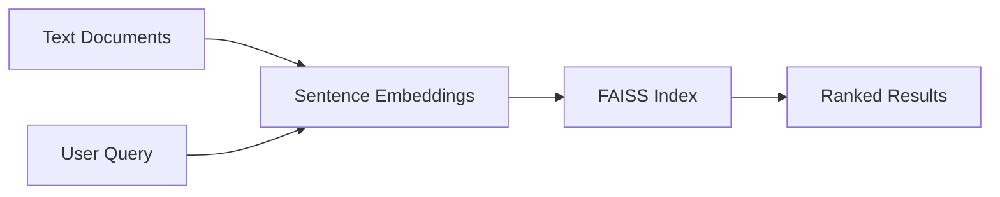

# Semantic Search Engine

[](https://www.python.org/)
[](https://github.com/facebookresearch/faiss)
[](LICENSE)

Vector-based semantic search using sentence embeddings and FAISS indexing. Index a folder of documents, query by meaning — not just keywords.

## How it works



## Quick start

```bash
python -m venv .venv && source .venv/bin/activate
pip install -r requirements.txt
make demo
```

Expected output:

```
indexed 4 documents
[0.842] Raft is a consensus algorithm for managing a replicated log...
[0.731] Sentence embeddings map text to dense vectors...
```

## CLI usage

```bash
# Build index from text files
python -m search index --docs ./sample_docs

# Query by semantic similarity
python -m search query "distributed consensus algorithms"

# Start REST API
python -m search serve --port 8000
```

**API endpoints**

| Method | Path | Body |
|--------|------|------|
| `POST` | `/index` | `{"documents": ["text1", "text2"]}` |
| `POST` | `/search` | `{"query": "...", "k": 5}` |

## Features

- Sentence-transformers embeddings (`all-MiniLM-L6-v2`)
- FAISS inner-product index for fast nearest-neighbor search
- Hash-embedding fallback when models aren't available
- CLI and FastAPI REST server
- Index persistence to JSON

## Project layout

```
search/
  embedder.py   Text → vector encoding
  index.py      FAISS-backed search index
  api.py        FastAPI REST server
  __main__.py   CLI entrypoint
sample_docs/    Example documents
```

## Development

```bash
make install   # venv + deps
make demo      # index sample docs and run a query
make serve     # start API on :8000
```

## License

MIT — see [LICENSE](LICENSE).
